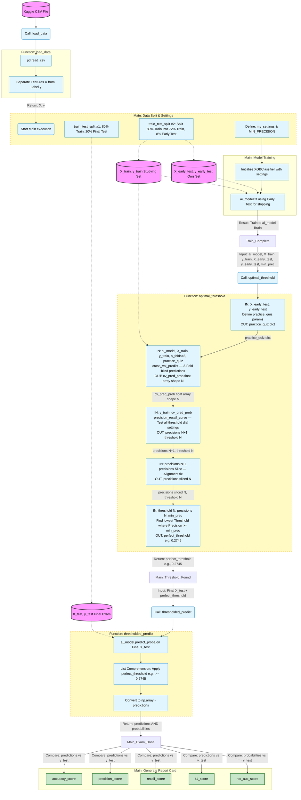

```mermaid
graph TD
    %% Define Styles
    classDef storage fill:#f9f,stroke:#333,stroke-width:2px,color:black;
    classDef process fill:#e1f5fe,stroke:#0277bd,stroke-width:1px,color:black;
    classDef function fill:#fff9c4,stroke:#fbc02d,stroke-width:1px,stroke-dasharray: 5 5,color:black;
    classDef output fill:#c8e6c9,stroke:#2e7d32,stroke-width:2px,color:black;

    %% 1. Data Source
    Data[(Kaggle CSV File)]:::storage

    %% 2. Function: load_data
    subgraph Func_Load [Function: load_data]
        Read[pd.read_csv]:::process
        Split_XY[Separate Features X from Label y]:::process
    end
    Data --> Load_Call(Call: load_data):::process
    Load_Call --> Read
    Read --> Split_XY
    Split_XY --> |Return: X, y| Main_Start

    %% 3. Main Flow - Preparation
    subgraph Main_Prep [Main: Data Split & Settings]
        Main_Start(Start Main execution):::process
        Split_Final[train_test_split #1: 80% Train, 20% Final Test]:::process
        Split_Early[train_test_split #2: Split 80% Train into 72% Train, 8% Early Test]:::process
        Define_Configs[Define: my_settings & MIN_PRECISION]:::process
    end
    Main_Prep:::function

    %% 4. Model Training
    subgraph Main_Train [Main: Model Training]
        XGB_Init[Initialize XGBClassifier with settings]:::process
        Model_Fit[ai_model.fit using Early Test for stopping]:::process
    end
    Define_Configs --> XGB_Init
    XGB_Init --> Model_Fit
    Model_Fit --> |Result: Trained ai_model Brain| Train_Complete

    %% 5. Threshold Optimization
    subgraph Func_Optimal [Function: optimal_threshold]
        P_Quiz["IN: X_early_test, y_early_test<br/>Define practice_quiz params<br/>OUT: practice_quiz dict"]:::process
        CV_Pred["IN: ai_model, X_train, y_train, n_folds=3, practice_quiz<br/>cross_val_predict — 3-Fold blind predictions<br/>OUT: cv_pred_prob float array shape N"]:::process
        PR_Curve["IN: y_train, cv_pred_prob<br/>precision_recall_curve — Test all threshold dial settings<br/>OUT: precisions N+1, threshold N"]:::process
        Cleanup["IN: precisions N+1<br/>precisions Slice — Alignment fix<br/>OUT: precisions sliced N"]:::process
        Find_Min["IN: threshold N, precisions N, min_prec<br/>Find lowest Threshold where Precision >= min_prec<br/>OUT: perfect_threshold e.g. 0.2745"]:::process
    end
    Func_Optimal:::function

    Train_Complete --> |Input: ai_model, X_train, y_train, X_early_test, y_early_test, min_prec| Opt_Call(Call: optimal_threshold):::process
    Opt_Call --> P_Quiz
    P_Quiz --> |practice_quiz dict| CV_Pred
    CV_Pred --> |cv_pred_prob float array shape N| PR_Curve
    PR_Curve --> |precisions N+1, threshold N| Cleanup
    Cleanup --> |precisions sliced N, threshold N| Find_Min
    Find_Min --> |Return: perfect_threshold e.g., 0.2745| Main_Threshold_Found

    %% 6. Final Exam
    subgraph Func_Thresh_Pred [Function: thresholded_predict]
        Get_Proba[ai_model.predict_proba on Final X_test]:::process
        Apply_Rule[List Comprehension: Apply perfect_threshold e.g., >= 0.2745]:::process
        Make_Array[Convert to np.array - predictions]:::process
    end
    Func_Thresh_Pred:::function

    Main_Threshold_Found --> |Input: Final X_test + perfect_threshold| Pred_Call(Call: thresholded_predict):::process
    Pred_Call --> Get_Proba
    Get_Proba --> Apply_Rule
    Apply_Rule --> Make_Array
    Make_Array --> |Return: predictions AND probabilities| Main_Exam_Done

    %% 7. Reporting
    subgraph Main_Report [Main: Generate Report Card]
        Acc_Score[accuracy_score]:::output
        Prec_Score[precision_score]:::output
        Rec_Score[recall_score]:::output
        F1_Score[f1_score]:::output
        ROC_Score[roc_auc_score]:::output
    end

    Main_Exam_Done --> |Compare: predictions vs y_test| Acc_Score
    Main_Exam_Done --> |Compare: predictions vs y_test| Prec_Score
    Main_Exam_Done --> |Compare: predictions vs y_test| Rec_Score
    Main_Exam_Done --> |Compare: predictions vs y_test| F1_Score
    Main_Exam_Done --> |Compare: probabilities vs y_test| ROC_Score

    %% 8. Data Repositories
    Final_Data[(X_test, y_test Final Exam)]:::storage
    Train_Data[(X_train, y_train Studying Set)]:::storage
    Early_Data[(X_early_test, y_early_test Quiz Set)]:::storage

    Split_Final -.-> Final_Data
    Split_Early -.-> Train_Data
    Split_Early -.-> Early_Data

    %% Connect Data to Processes
    Train_Data -.-> Model_Fit
    Early_Data -.-> Model_Fit
    Train_Data -.-> CV_Pred
    Final_Data -.-> Get_Proba
```